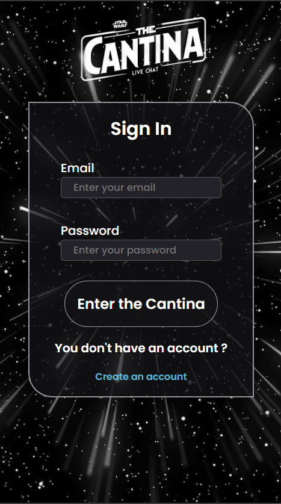
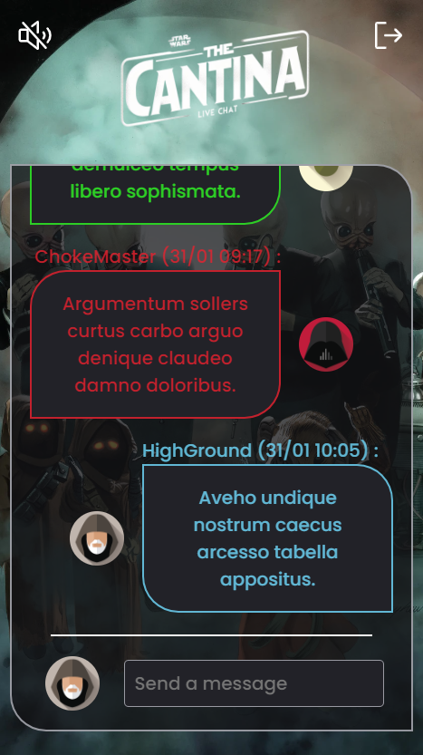
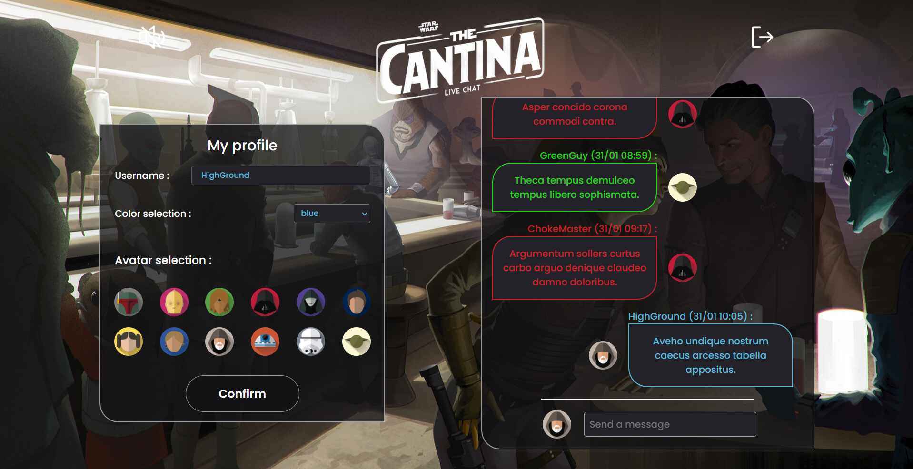

## Concept

The Cantina is a real time chat application developped with React during the final test of my 5 month bootcamp formation where we had 48 hours to build a full-stack application.

Set in the Star Wars universe, you can host this application to chat with people inside your local network.

### Visuals

